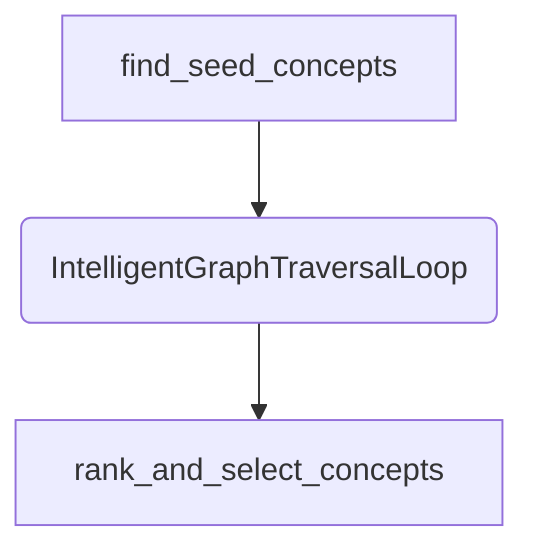

Of course. Here is a comprehensive, updated roadmap for `flujo` that integrates the unified AI-first strategy with your existing plans.

First, let's analyze the status of your current roadmap items based on the provided project files.

### Analysis of Current Roadmap and Project Status

Based on the file contents, here's what has already been implemented:

*   **`ParallelStep`:** ✅ **Implemented.** The `flujo/domain/pipeline_dsl.py` file contains the `ParallelStep` class and the `Step.parallel` factory. The `flujo_engine.py` also contains the `_execute_parallel_step_logic` function. The core logic for concurrent execution exists.
*   **Context Safety (`Isolate-and-Merge`):** ✅ **Partially Implemented.** The `DummyRemoteBackend` test hints at serialization/deserialization, and `_execute_parallel_step_logic` creates a `deepcopy` of the context for each branch, which aligns with the "Isolate" part of the strategy. The "Merge" part (handling conflicts) does not appear to be implemented yet.
*   **`fallback` Logic:** ❌ **Not Implemented.** The `Step` class in `pipeline_dsl.py` does not have a `fallback` method or a `fallback_step` attribute. The engine logic for handling this is also absent. This remains a valid future item.

Now, let's build the new, detailed roadmap.

---

# Flujo Project Roadmap: The Path to an AI-First Framework

**Last Updated:** June 25, 2025
**Status:** In Progress

## Vision Statement

To evolve `flujo` from a developer-centric orchestration library into a truly **AI-native framework**. The primary user persona we are designing for is a generative AI model, which requires an API that is explicit, discoverable, structured, and provides actionable feedback. This roadmap outlines the features and architectural changes required to achieve this vision, enabling both humans and AI agents to build, modify, and reason about complex workflows with ease.

---

## Theme 1: Production-Grade Control Flow (Resilience & Performance)

*Goal: Enhance the core DSL with robust patterns for handling real-world complexity like failures and I/O latency.*

| Epic | Status | Description & Key Tasks | Target Release |
| :--- | :--- | :--- | :--- |
| **Parallel Execution** | 🚧 **In Progress** | Implement concurrent execution of pipeline branches. | v0.5.0 |
| | ✅ Implemented | `Step.parallel` factory and `ParallelStep` class. | |
| | ✅ Implemented | `asyncio.TaskGroup`-based concurrency for structured execution. | |
| | ✅ Implemented | Basic context isolation via `deepcopy`. | |
| | ⏳ **To Do** | Implement **conflict-aware context merging**. Add an optional `on_context_conflict` handler to `Step.parallel` for custom merge logic. | |
| | ⏳ **To Do** | Enhance `StepResult` from `ParallelStep` to include a dictionary of individual branch results for better traceability. | |
| | ⏳ **To Do** | Write comprehensive documentation and a cookbook recipe for `Step.parallel`. | |
| **Fallback Logic** | 📝 **Proposed** | Introduce a declarative `fallback` mechanism for steps to handle transient errors gracefully. | v0.6.0 |
| | ⏳ **To Do** | Add `.fallback(other_step: Step)` method to the `Step` class. | |
| | ⏳ **To Do** | Modify the `flujo_engine` to catch step failures and execute the `fallback_step` with the original input. | |
| | ⏳ **To Do** | Enhance `StepResult.metadata_` to include `fallback_triggered` and the results of both the primary and fallback attempts. | |
| | ⏳ **To Do** | Add unit and integration tests for various fallback scenarios (e.g., fallback succeeds, fallback also fails). | |

---

## Theme 2: AI-Native API & Pipeline Construction

*Goal: Make pipeline construction explicit, structured, and intuitive for a generative AI model, reducing reliance on custom syntax and implicit magic.*

| Epic | Status | Description & Key Tasks | Target Release |
| :--- | :--- | :--- | :--- |
| **Declarative Pipeline Builder** | 📝 **Proposed** | Introduce a primary, AI-friendly way to build pipelines from structured data. | v0.7.0 |
| | ⏳ **To Do** | Design and implement a stable JSON/YAML schema for pipeline definitions. | |
| | ⏳ **To Do** | Create `Pipeline.from_definition(dict)` and `pipeline.to_dict()` methods for serialization and deserialization. | |
| | ⏳ **To Do** | Create an initial version of `docs/ai_patterns.md` demonstrating this new builder pattern as the canonical approach. | |
| **Fluent Builder API** | 📝 **Proposed** | Add a secondary, fluent API for programmatic pipeline construction. | v0.7.0 |
| | ⏳ **To Do** | Implement `Pipeline.builder().add_step(step).add_pipeline(pipeline)` methods. | |
| | ⏳ **To Do** | Ensure the builder correctly handles type flow and context propagation. | |
| **API Simplification & Consistency** | 🚧 **In Progress** | Deprecate confusing or redundant patterns and enforce consistent naming. | v0.5.0 |
| | ✅ Implemented | The library already favors a single `Flujo` engine over the `Default` recipe, aligning with simplification. | |
| | ⏳ **To Do** | Formally deprecate the `Default` recipe in documentation, guiding users to the more flexible `Flujo` engine and builders. | |
| | ⏳ **To Do** | Add `Step.validate` as an alias for `Step.validate_step` to improve naming consistency. Mark the old name for deprecation. | |
| | ⏳ **To Do** | Introduce a single, explicit `flujo.configure()` function for setting global configurations (API keys, models). | |

---

## Theme 3: Introspection and Safe Modification

*Goal: Empower AI agents to understand, analyze, and safely modify pipelines programmatically.*

| Epic | Status | Description & Key Tasks | Target Release |
| :--- | :--- | :--- | :--- |
| **Step Registry & Introspection** | 📝 **Proposed** | Create a central registry for discoverability and a public API for introspection. | v0.8.0 |
| | ⏳ **To Do** | Modify the `@step` decorator and `Step.from_callable` to optionally register steps in a global `STEP_REGISTRY`. | |
| | ⏳ **To Do** | Create the `flujo.introspect` module with `list_steps()` and `get_step_schema(step_name)` functions. | |
| | ⏳ **To Do** | Implement `flujo.introspect.explain_pipeline(pipeline)` to return a structured or natural language description. | |
| **Programmatic Pipeline Editing**| 📝 **Proposed** | Provide safe, high-level methods for an AI to modify a pipeline's structure. | v0.9.0 |
| | ⏳ **To Do** | Implement `pipeline.insert_after(step_name, new_step)`. | |
| | ⏳ **To Do** | Implement `pipeline.replace(step_name, new_step)`. | |
| | ⏳ **To Do** | Implement `pipeline.remove(step_name)`. | |
| | ⏳ **To Do** | Ensure all modification methods trigger a re-validation of the pipeline's type flow. | |

---

## Theme 4: AI-Centric Feedback and Extensibility

*Goal: Make the framework's feedback loop and extension patterns explicit and easy for an AI to learn from.*

| Epic | Status | Description & Key Tasks | Target Release |
| :--- | :--- | :--- | :--- |
| **Actionable Error System** | 📝 **Proposed** | Rework exceptions to provide structured, helpful suggestions for AI agents. | v0.8.0 |
| | ⏳ **To Do** | Create the `flujo.ai_errors` module with `AIFriendlyError` base class containing a `suggestion` field. | |
| | ⏳ **To Do** | Refactor the `flujo_engine` to catch internal errors (e.g., `TypeMismatchError`) and re-raise them as `AITypeMismatchError` with a concrete suggestion. | |
| | ⏳ **To Do** | Audit all user-facing exceptions and augment them with AI-friendly guidance. | |
| **Formalized Extension APIs** | 📝 **Proposed** | Simplify the process of creating new, reusable `Step` types. | v0.9.0 |
| | ⏳ **To Do** | Create an `AbstractStep` base class or mixins to encapsulate Pydantic initialization logic. | |
| | ⏳ **To Do** | Document a clear, simple pattern for creating new step types like `RetryStep` or `CacheStep`. | |
| | ⏳ **To Do** | Add a new "Extending Flujo" guide in the documentation focused on these new patterns. | |

---

## Theme 5: The Vision - Natural Language Orchestration

*Goal: Achieve the ultimate AI-first experience where the AI describes the workflow and `flujo` builds it.*

| Epic | Status | Description & Key Tasks | Target Release |
| :--- | :--- | :--- | :--- |
| **Natural Language Builder** | 📝 **Proposed** | Create a high-level function that uses an LLM to translate a natural language description into a `flujo` pipeline. | v1.0.0 |
| | ⏳ **To Do** | Create an internal "Builder Agent" that uses the `flujo.introspect` module as its toolset. | |
| | ⏳ **To Do** | The Builder Agent's goal is to output a valid pipeline definition dictionary. | |
| | ⏳ **To Do** | Implement the public-facing `flujo.build_from_description(description: str)` function, which orchestrates the Builder Agent and uses its output to call `Pipeline.from_definition()`. | |
| | ⏳ **To Do** | Create "AI dogfooding" tests where an LLM is prompted to build and run a pipeline using this new function. | |

---

## Theme 6: PydanticAI-Inspired Ergonomic Enhancements

Of course. Analyzing a mature, parallel library like `PydanticAI` is a fantastic way to identify potential improvements for `flujo`. Based on the extensive documentation you provided, `PydanticAI` has several powerful concepts that could enhance `flujo`'s ergonomics and capabilities, while still respecting "The Flujo Way."

Here is a detailed analysis and a set of formal feature proposals you could send to the Flujo team.

---

### **FSD: Proposals for Enhancing `flujo` Inspired by `PydanticAI`**

**To:** The Flujo Development Team  
**From:** A User of the Concept Discovery V2 Pipeline  
**Date:** October 26, 2023  
**Subject:** Proposal for New Convenience Methods and Features to Enhance `flujo`

#### **Executive Summary**

The `flujo` library provides a powerful and explicit DSL for building robust AI workflows. Based on a deep analysis of the `PydanticAI` agent framework, we have identified four key areas where `flujo` could be enhanced to reduce boilerplate, improve testing ergonomics, and offer more granular control over agent interactions. These proposals are designed to be additive and fully aligned with the existing philosophy of "The Flujo Way."

The proposed additions are:
1. **Granular In-Flight Error Handling**: Introduce a mechanism for agents/plugins to request a retry *with specific feedback* sent to the LLM for self-correction.
2. **Pre-Request History Processing**: Add a `history_processors` hook to transform the conversation history before it's sent to the LLM, useful for summarization or redaction.
3. **Enhanced Testing Ergonomics**: Introduce a context manager (`flujo.override_agent`) to simplify unit testing of application code that uses Flujo internally.
4. **Automatic Pipeline Visualization**: Add a `.to_mermaid()` method to `flujo.Pipeline` for automatic workflow visualization.

---

### **Proposal 1: Granular In-Flight Error Handling (Inspired by `ModelRetry`)**

**The Opportunity:**  
`PydanticAI` allows a tool to raise a `ModelRetry` exception with a specific error message. This message is then passed back to the LLM, instructing it to correct its parameters and try the tool call again. This is a powerful, targeted self-correction mechanism.

**How Flujo Handles This Today:**  
`flujo` has a robust retry system at the `Step` level (`max_retries`). A `ValidationPlugin` can fail a step by returning `PluginOutcome(success=False, feedback="...")`. If the step is configured to retry, the *entire step* is re-run. The feedback from the failed attempt is prepended to the next attempt's prompt, which is good but not as targeted as `PydanticAI`'s approach.

**The PydanticAI Approach:**
```python
# In PydanticAI, a tool can do this:

def my_flaky_tool(query: str) -> str:
    if query == 'bad':
        # This message goes directly back to the LLM for the retry.
        raise ModelRetry("The query 'bad' is not allowed. Please provide a different query.")
    return 'Success!'
```

**Proposed Flujo Enhancement:**
Enhance `PluginOutcome` to allow for a more explicit retry signal. This gives developers finer control over the retry mechanism.

```python
# In flujo/domain/plugins.py
class PluginOutcome(BaseModel):
    # ... existing fields ...
    # Add a new field:
    request_retry_with_feedback: bool = False 
```

The `flujo` engine would then be updated to check for this flag. If `True`, it would immediately trigger a retry of just the agent call (not the whole step logic), using the `feedback` field to inform the LLM.

**Example (Before & After):**

**Before:** A plugin can only mark the whole step for a generic retry.
```python
class MyPlugin(ValidationPlugin):
    async def validate(self, data: dict) -> PluginOutcome:
        if "bad" in data['output']:
            return PluginOutcome(success=False, feedback="Query was bad.")
        return PluginOuputcome(success=True)
```

**After:** The plugin can explicitly request a targeted, corrective retry.
```python
class MyPlugin(ValidationPlugin):
    async def validate(self, data: dict) -> PluginOutcome:
        if "bad" in data['output']:
            # Signal the engine to immediately retry the agent with this specific feedback
            return PluginOutcome(
                success=False, 
                feedback="The query 'bad' is not allowed. Please provide a different query.",
                request_retry_with_feedback=True 
            )
        return PluginOutcome(success=True)
```

**Benefits:**
- **More Efficient Correction**: Avoids re-running all plugins on a retry.
- **Clearer Intent**: Makes the self-correction loop more explicit.
- **Increased Power**: Aligns `flujo`'s capabilities with advanced patterns seen in other frameworks.

---

### **Proposal 2: Pre-Request History Processors**

**The Opportunity:**  
`PydanticAI` allows developers to register `history_processors` on an `Agent`. These are functions that are applied to the conversation history *before* it's sent to the model. This is extremely useful for managing context window size (e.g., by summarizing old messages), redacting sensitive information, or dynamically adding context.

**How Flujo Handles This Today:**  
`flujo` has `AgentProcessors` for `prompt_processors`, which can modify the *current* input. However, there is no built-in, convenient hook specifically for processing the *entire message history* that might be part of the prompt context. A user would have to build this logic into a custom `Processor`, which is less ergonomic.

**The PydanticAI Approach:**
```python
# In PydanticAI

def summarize_old_messages(messages: list[ModelMessage]) -> list[ModelMessage]:
    if len(messages) > 10:
        # ... logic to summarize the first 10 messages ...
        return [summary_message] + messages[10:]
    return messages

agent = Agent('openai:gpt-4o', history_processors=[summarize_old_messages])
```

**Proposed Flujo Enhancement:**
Add a `history_processors` argument to `make_agent_async` and `Step`. This would provide a clean, dedicated hook for this common requirement.

```python
# In flujo/infra/agents.py
def make_agent_async(
    # ... existing args ...,
    history_processors: List[Callable[[str], str]] | None = None,
    # ...
) -> AsyncAgentWrapper:
    # ...
```

The engine would apply these processors to the prompt context before making the final LLM call.

**Benefits:**
- **Context Window Management**: Provides a simple solution to a critical problem in long-running conversations.
- **Security & Privacy**: Enables easy implementation of PII redaction from conversation history.
- **Improved Ergonomics**: Offers a more direct and intuitive API than creating a full custom `Processor`.

---

### **Proposal 3: Enhanced Testing Ergonomics with an `override` Context Manager**

**The Opportunity:**  
`PydanticAI` provides a context manager, `agent.override(model=...)`, which temporarily replaces an agent's model. This is incredibly useful for unit testing application code that internally instantiates and uses an agent, as it avoids complex mocking or dependency injection into the application code itself.

**How Flujo Handles This Today:**  
`flujo` has excellent testing utilities like `StubAgent`. However, to use them, you must inject them when the `Flujo` runner is instantiated. If your application code creates its own `Flujo` runner deep inside a function, testing becomes difficult. You would have to refactor your application to accept the agent as a dependency.

**The PydanticAI Approach:**
```python
# In a PydanticAI test
async def test_application_code():
    with joke_agent.override(model=TestModel()): # Temporarily patches joke_agent
        joke = await application_code('Tell me a joke.')
    assert joke.startswith('Did you hear about')
```

**Proposed Flujo Enhancement:**
Introduce a similar context manager at the `flujo` module level.

```python
# New feature in flujo
import flujo

@flujo.step
async def real_agent_step(text: str) -> str:
    # ... makes a real LLM call ...

# In a test file
from flujo.testing.utils import StubAgent
import flujo

async def test_my_app_function():
    # my_app_function internally uses `real_agent_step`
    with flujo.override_agent(real_agent_step, StubAgent(["fake response"])):
        result = await my_app_function("test input")
    
    assert result == "fake response"
```

**Benefits:**
- **Dramatically Simplifies Testing**: Allows testing of application logic without refactoring for dependency injection.
- **Less Mocking Boilerplate**: Avoids complex `unittest.mock.patch` setups.
- **Promotes Testability**: Encourages writing tests for higher-level application logic.

---

### **Proposal 4: Automatic Pipeline Visualization (Inspired by `pydantic-graph`)**

**The Opportunity:**  
`pydantic-graph`, which powers `PydanticAI`, can automatically generate Mermaid diagram code from a graph definition (`graph.mermaid_code(...)`). This provides instant, accurate documentation and visualization of complex workflows.

**How Flujo Handles This Today:**  
There is no built-in visualization tool. Developers must manually create diagrams, which can easily become outdated as the pipeline code evolves.

**Proposed Flujo Enhancement:**
Add a `.to_mermaid()` method to the `flujo.Pipeline` class. This method would inspect the `steps` list and generate a Mermaid `graph TD` definition.

**Example:**
```python
pipeline = (
    find_seed_concepts >> 
    discovery_loop >> 
    rank_and_select_concepts
)

# New proposed method
mermaid_code = pipeline.to_mermaid()
print(mermaid_code)
```

**Generated Output:**

*(Node shapes could indicate step type, e.g., `()` for loops, `{}` for conditionals)*

**Benefits:**
- **Living Documentation**: Ensures that workflow diagrams are always in sync with the code.
- **Improved Understanding**: Helps developers visualize and reason about complex control flow.
- **Enhanced Debugging**: Makes it easier to trace the flow of execution and identify potential issues.

By adopting these proven concepts from `PydanticAI`, `flujo` can become even more powerful, robust, and developer-friendly, solidifying its position as a leading framework for production-grade AI orchestration.