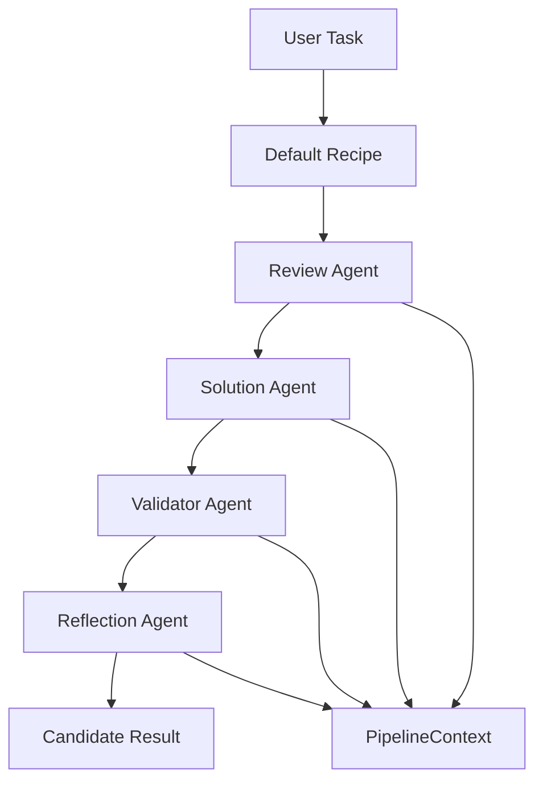
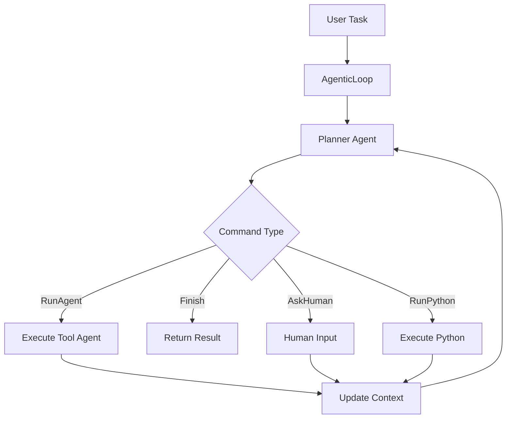
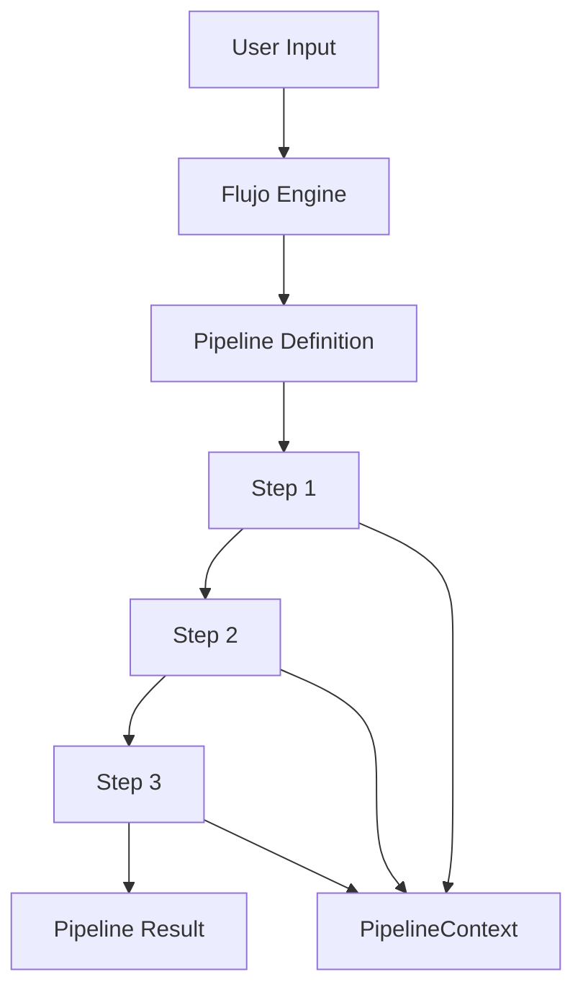

# Architecture Overview

This guide explains Flujo's internal architecture and how the components work together to provide a robust, extensible AI workflow orchestration system.

## High-Level Architecture

Flujo follows a clean architecture pattern with clear separation of concerns across four main layers:

### Application Layer
The **Application Layer** contains high-level orchestration logic and user-facing interfaces:

- **`Flujo` Engine**: The core orchestrator that executes pipelines and manages workflow state
- **Recipes**: Pre-built workflow patterns like `Default` and `AgenticLoop`
- **Self-Improvement**: Automated evaluation and optimization systems
- **Temperature Management**: Dynamic model parameter adjustment

### Domain Layer
The **Domain Layer** contains core business logic and models:

- **Pipeline DSL**: The domain-specific language for building workflows
- **Models**: Core data structures (`Task`, `Candidate`, `PipelineContext`, etc.)
- **Validation**: Pipeline validation and type checking
- **Scoring**: Quality assessment and evaluation logic
- **Commands**: Agent command protocol for dynamic workflows

### Infrastructure Layer
The **Infrastructure Layer** handles external integrations and system concerns:

- **Agents**: LLM integrations and agent implementations
- **Backends**: Execution backends and model providers
- **Settings**: Configuration management and environment handling
- **Telemetry**: Observability and monitoring systems
- **Tools**: External tool integrations and adapters

### CLI Layer
The **CLI Layer** provides command-line interfaces:

- **Main Commands**: `solve`, `bench`, `show-config`, etc.
- **Development Tools**: Testing, evaluation, and debugging utilities

## Module Structure

```
flujo/
├── application/          # High-level orchestration
│   ├── flujo_engine.py   # Core Flujo engine
│   ├── evaluators.py     # Evaluation systems
│   └── self_improvement.py # Self-improvement logic
├── domain/              # Core business logic
│   ├── models.py        # Core data models
│   ├── pipeline_dsl.py  # Pipeline DSL implementation
│   ├── scoring.py       # Scoring and evaluation
│   ├── commands.py      # Agent command protocol
│   └── validation.py    # Validation logic
├── infra/               # Infrastructure components
│   ├── agents.py        # Built-in agent implementations
│   ├── backends.py      # Execution backends
│   ├── settings.py      # Configuration management
│   └── telemetry.py     # Observability systems
├── recipes/             # Pre-built workflow patterns
│   ├── default.py       # Default recipe implementation
│   └── agentic_loop.py  # AgenticLoop pattern
├── cli/                 # Command-line interface
│   └── main.py          # CLI entry points
└── testing/             # Testing utilities
    └── assertions.py    # Test assertions and helpers
```

## Component Interaction Flow

### Default Recipe Execution



### AgenticLoop Execution



### Pipeline DSL Execution



## Key Design Principles

### 1. Type Safety First
- All components use Pydantic models for data validation
- Type hints throughout the codebase
- Compile-time error detection where possible

### 2. Async-First Design
- All I/O operations are asynchronous
- Efficient concurrent execution
- Non-blocking pipeline execution

### 3. Extensibility
- Plugin system for custom components
- Custom agent and tool support
- Configurable validation and scoring

### 4. Observability
- Built-in telemetry and tracing
- Comprehensive logging
- Performance monitoring capabilities

### 5. Production Ready
- Error handling and recovery
- Retry mechanisms
- Resource management
- Cost controls

## Data Flow

### Pipeline Context
The `PipelineContext` serves as shared memory across pipeline steps:

```python
class PipelineContext(BaseModel):
    run_id: str
    prompt: str
    scratchpad: Dict[str, Any] = Field(default_factory=dict)
    hitl_history: List[HumanInteraction] = Field(default_factory=list)
```

### Step Execution
Each step in a pipeline follows this pattern:

1. **Input Processing**: Validate and transform input data
2. **Agent Execution**: Run the associated agent with tools and context
3. **Output Processing**: Validate and transform output data
4. **Context Update**: Update shared pipeline context
5. **Result Recording**: Log step results for debugging and analysis

### Error Handling
Flujo implements a comprehensive error handling strategy:

- **Step-Level Errors**: Individual step failures don't stop the pipeline
- **Retry Logic**: Automatic retries for transient failures
- **Fallback Mechanisms**: Alternative execution paths when possible
- **Error Reporting**: Detailed error information for debugging

## Extensibility Points

### Custom Agents
```python
from flujo import make_agent_async

custom_agent = make_agent_async(
    "openai:gpt-4",
    "Your system prompt",
    YourOutputModel
)
```

### Custom Tools
```python
from flujo import Tool

@Tool.register
async def my_tool(input_data: str) -> str:
    # Your tool implementation
    return processed_data
```

### Custom Validators
```python
from flujo import Validator

class MyValidator(Validator):
    async def validate(self, output: Any, context: PipelineContext) -> ValidationResult:
        # Your validation logic
        return ValidationResult(passed=True, score=0.9)
```

### Custom Processors
```python
from flujo import Processor

class MyProcessor(Processor):
    async def process(self, data: Any, context: PipelineContext) -> Any:
        # Your processing logic
        return processed_data
```

## Performance Considerations

### Concurrency
- Pipeline steps can run concurrently when possible
- Async I/O for all external calls
- Efficient resource sharing

### Caching
- Agent responses can be cached
- Tool results cached by default
- Configurable cache invalidation

### Resource Management
- Connection pooling for external services
- Memory-efficient context management
- Automatic cleanup of resources

## Security

### Input Validation
- All inputs validated with Pydantic
- Sanitization of user-provided data
- Protection against injection attacks

### API Key Management
- Secure storage of API keys
- Environment variable support
- No hardcoded credentials

### Access Control
- Configurable permissions for tools
- Sandboxed Python execution
- Audit logging for sensitive operations

## Monitoring and Observability

### Telemetry
- OpenTelemetry integration
- Custom metrics and traces
- Performance monitoring

### Logging
- Structured logging throughout
- Configurable log levels
- Debug information for troubleshooting

### Health Checks
- Pipeline health monitoring
- Agent availability checks
- Resource usage tracking

This architecture provides a solid foundation for building reliable, scalable AI workflows while maintaining flexibility for customization and extension. 