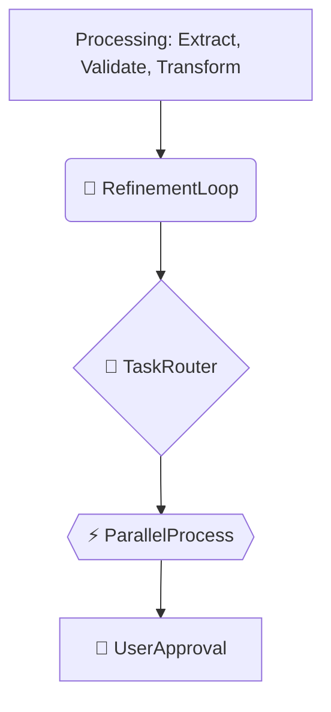

# Pipeline Visualization - AUTO (Auto-detected: LOW)

```mermaid
graph TD
    s1["Processing: Extract, Validate, Transform"];
    s2("🔄 RefinementLoop")
    s1 --> s2;
    s3{"🔀 TaskRouter"}
    s2 --> s3;
    s4{{⚡ ParallelProcess}}
    s3 --> s4;
    s5["👤 UserApproval"]
    s4 --> s5;
```
