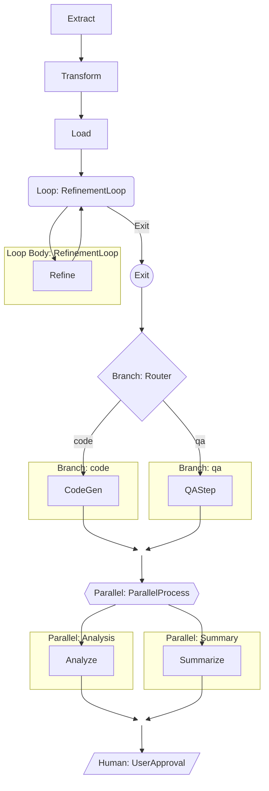

# Pipeline Visualization

```mermaid
graph TD
    s1["Extract"];
    s2["Transform"];
    s1 --> s2;
    s3["Load"];
    s2 --> s3;
    s4("Loop: RefinementLoop");
    s3 --> s4;
    subgraph "Loop Body: RefinementLoop"
    s5["Refine"];
    end
    s4 --> s5;
    s5 --> s4;
    s4_exit(("Exit"));
    s4 --> |"Exit"| s4_exit;
    s6{"Branch: Router"};
    s4_exit --> s6;
    subgraph "Branch: code"
    s7["CodeGen"];
    end
    s6 --> |"code"| s7;
    subgraph "Branch: qa"
    s8["QAStep"];
    end
    s6 --> |"qa"| s8;
    s6_join(( ));
    style s6_join fill:none,stroke:none
    s7 --> s6_join;
    s8 --> s6_join;
    s9{{"Parallel: ParallelProcess"}};
    s6_join --> s9;
    subgraph "Parallel: Analysis"
    s10["Analyze"];
    end
    s9 --> s10;
    subgraph "Parallel: Summary"
    s11["Summarize"];
    end
    s9 --> s11;
    s9_join(( ));
    style s9_join fill:none,stroke:none
    s10 --> s9_join;
    s11 --> s9_join;
    s12[/Human: UserApproval/];
    s9_join --> s12;
```
