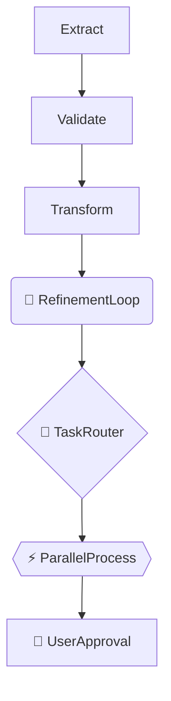

# Pipeline Visualization - MEDIUM Detail

```mermaid
graph TD
    s1["Extract"];
    s2["Validate"];
    s1 --> s2;
    s3["Transform"];
    s2 --> s3;
    s4("🔄 RefinementLoop");
    s3 --> s4;
    s5{"🔀 TaskRouter"};
    s4 --> s5;
    s6{{"⚡ ParallelProcess"}};
    s5 --> s6;
    s7["👤 UserApproval"];
    s6 --> s7;
```
